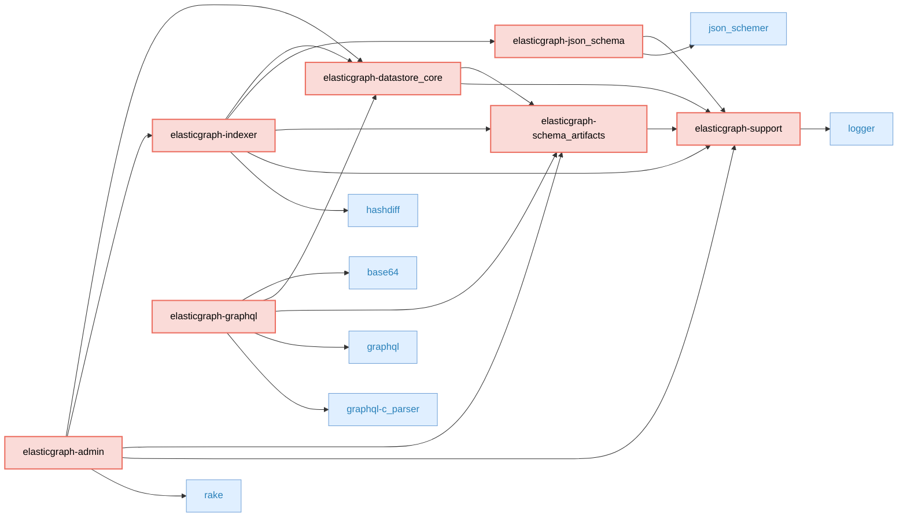
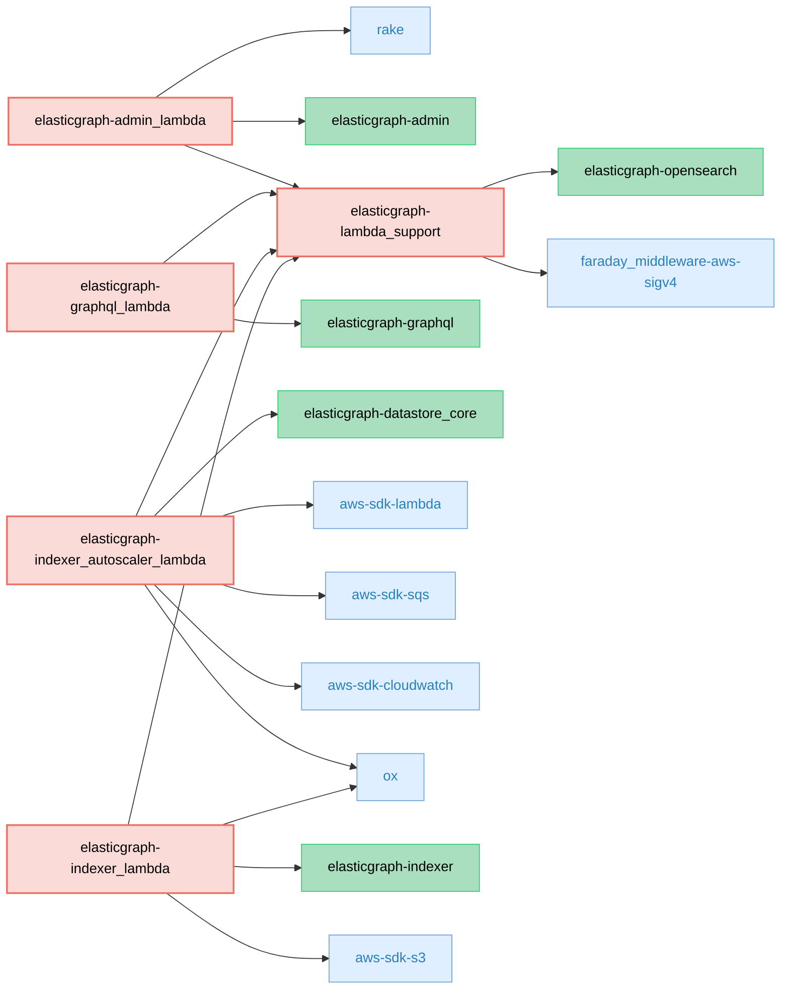
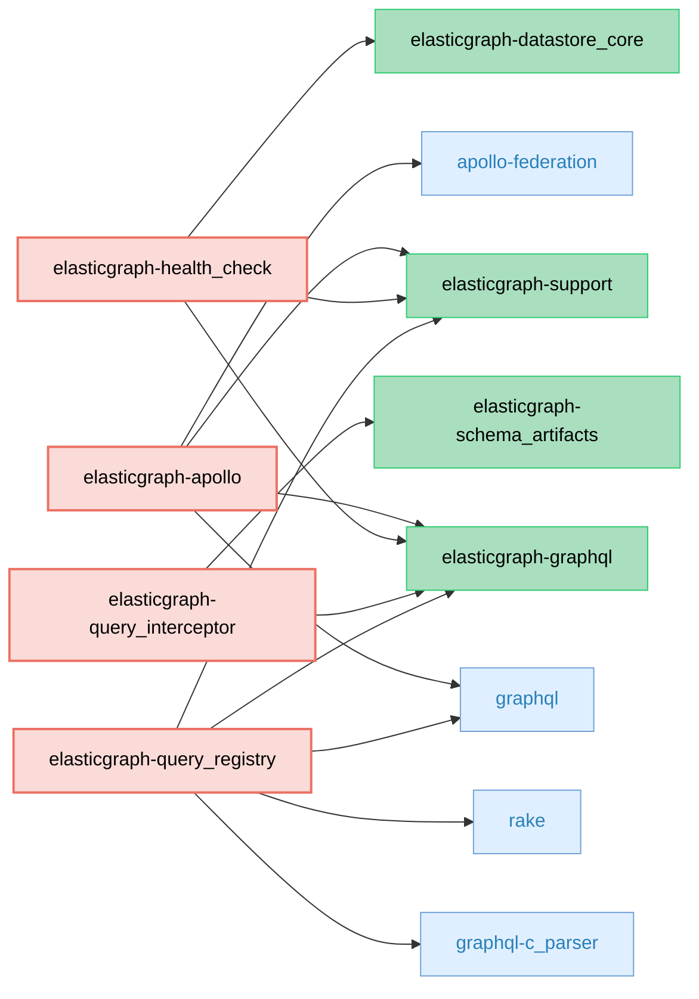
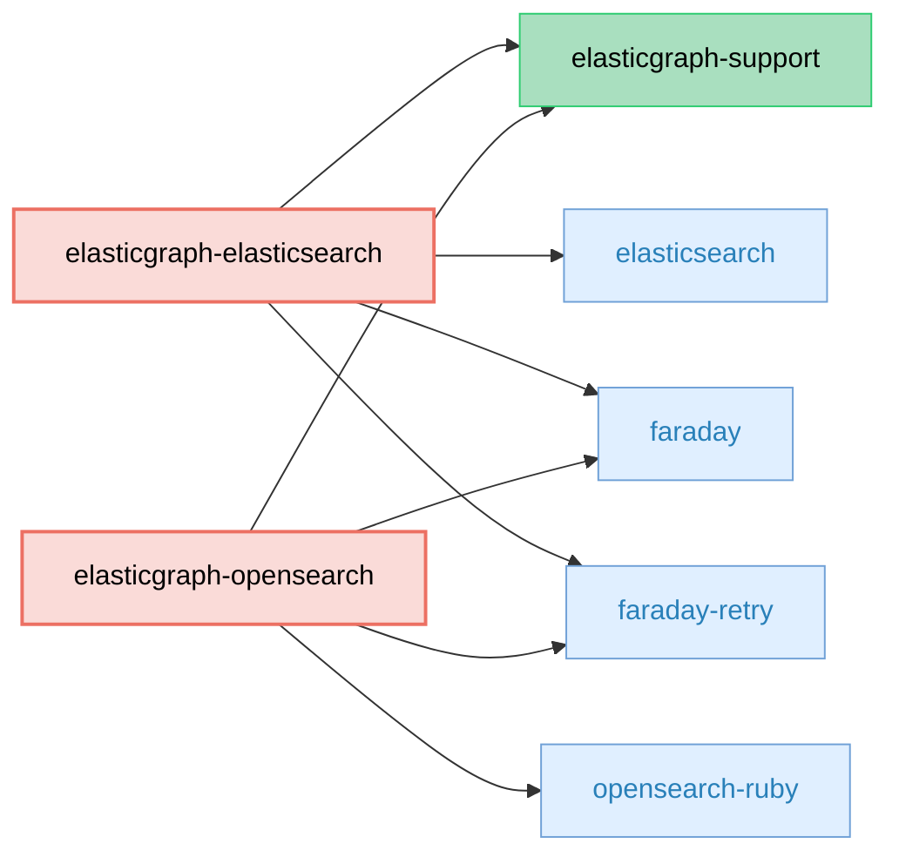
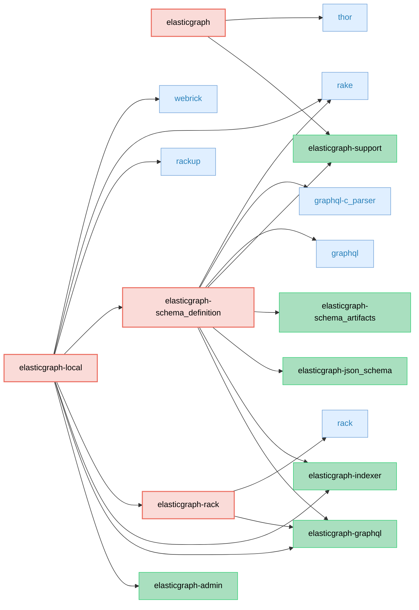

# ElasticGraph Codebase Overview

ElasticGraph is designed to be modular, with a small core, and many built-in extensions that extend that core
for specific use cases. This minimizes exposure to vulnerabilities, reduces bloat, and makes ongoing upgrades
easier. The libraries that ship with ElasticGraph can be broken down into several categories.

### Core Libraries (7 gems)

These libraries form the core backbone of ElasticGraph that is designed to run in a production deployment. Every ElasticGraph deployment will need to use all of these.

* [elasticgraph-admin](elasticgraph-admin/README.md): ElasticGraph gem that provides datastore administrative tasks, to keep a datastore up-to-date with an ElasticGraph schema.
* [elasticgraph-datastore_core](elasticgraph-datastore_core/README.md): ElasticGraph gem containing the core datastore support types and logic.
* [elasticgraph-graphql](elasticgraph-graphql/README.md): The ElasticGraph GraphQL query engine.
* [elasticgraph-indexer](elasticgraph-indexer/README.md): ElasticGraph gem that provides APIs to robustly index data into a datastore.
* [elasticgraph-json_schema](elasticgraph-json_schema/README.md): ElasticGraph gem that provides JSON Schema validation.
* [elasticgraph-schema_artifacts](elasticgraph-schema_artifacts/README.md): ElasticGraph gem containing code related to generated schema artifacts.
* [elasticgraph-support](elasticgraph-support/README.md): ElasticGraph gem providing support utilities to the other ElasticGraph gems.

#### Dependency Diagram

### AWS Lambda Integration Libraries (5 gems)

These libraries wrap the the core ElasticGraph libraries so that they can be deployed using AWS Lambda.

* [elasticgraph-admin_lambda](elasticgraph-admin_lambda/README.md): ElasticGraph gem that wraps elasticgraph-admin in an AWS Lambda.
* [elasticgraph-graphql_lambda](elasticgraph-graphql_lambda/README.md): ElasticGraph gem that wraps elasticgraph-graphql in an AWS Lambda.
* [elasticgraph-indexer_autoscaler_lambda](elasticgraph-indexer_autoscaler_lambda/README.md): ElasticGraph gem that monitors OpenSearch CPU utilization to autoscale indexer lambda concurrency.
* [elasticgraph-indexer_lambda](elasticgraph-indexer_lambda/README.md): Provides an AWS Lambda interface for an elasticgraph API
* [elasticgraph-lambda_support](elasticgraph-lambda_support/README.md): ElasticGraph gem that supports running ElasticGraph using AWS Lambda.

#### Dependency Diagram

### Extensions (4 gems)

These libraries extend ElasticGraph to provide optional but commonly needed functionality.

* [elasticgraph-apollo](elasticgraph-apollo/README.md): An ElasticGraph extension that implements the Apollo federation spec.
* [elasticgraph-health_check](elasticgraph-health_check/README.md): An ElasticGraph extension that provides a health check for high availability deployments.
* [elasticgraph-query_interceptor](elasticgraph-query_interceptor/README.md): An ElasticGraph extension for intercepting datastore queries.
* [elasticgraph-query_registry](elasticgraph-query_registry/README.md): An ElasticGraph extension that supports safer schema evolution by limiting GraphQL queries based on a registry and validating registered queries against the schema.

#### Dependency Diagram

### Datastore Adapters (2 gems)

These libraries adapt ElasticGraph to your choice of datastore (Elasticsearch or OpenSearch).

* [elasticgraph-elasticsearch](elasticgraph-elasticsearch/README.md): Wraps the Elasticsearch client for use by ElasticGraph.
* [elasticgraph-opensearch](elasticgraph-opensearch/README.md): Wraps the OpenSearch client for use by ElasticGraph.

#### Dependency Diagram

### Local Development Libraries (4 gems)

These libraries are used for local development of ElasticGraph applications, but are not intended to be deployed to production (except for `elasticgraph-rack`).
`elasticgraph-rack` is used to boot ElasticGraph locally but can also be used to run ElasticGraph in any rack-compatible server (including a Rails application).

* [elasticgraph](elasticgraph/README.md): Bootstraps ElasticGraph projects.
* [elasticgraph-local](elasticgraph-local/README.md): Provides support for developing and running ElasticGraph applications locally.
* [elasticgraph-rack](elasticgraph-rack/README.md): ElasticGraph gem for serving an ElasticGraph GraphQL endpoint using rack.
* [elasticgraph-schema_definition](elasticgraph-schema_definition/README.md): ElasticGraph gem that provides the schema definition API and generates schema artifacts.

#### Dependency Diagram

