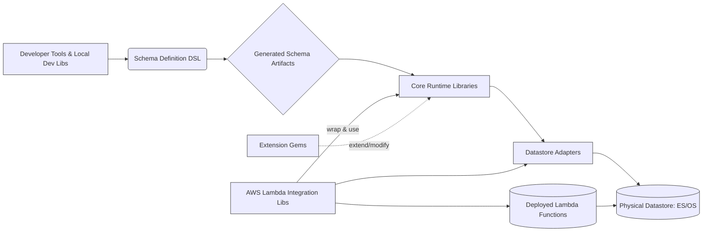

# ElasticGraph Project Memory Bank

This document serves as the primary, single source of truth for understanding the ElasticGraph project.

## Product Context

-   **Why this project exists**: ElasticGraph is a general purpose, near real-time data query and search platform.
-   **Problems it solves**: It addresses the need for a scalable and performant platform for rich interactive queries and simplified creation of complex reports.
-   **How it should work**: It combines the indexing and search power of Elasticsearch/OpenSearch with the query flexibility of GraphQL. It is optimized for AWS cloud.
-   **User experience goals**:
    -   Minimize network trips for data retrieval.
    -   Get exactly the needed data in a single query (no over- or under-serving).
    -   Push filtering and complex calculations to the backend.

## System Patterns

ElasticGraph is designed to be modular with a small core and many built-in extensions. The codebase is a monorepo containing multiple Ruby gems.

Key architectural characteristics:
-   **Modular Design**: Composed of several categories of gems:
    -   Core Libraries
    -   AWS Lambda Integration Libraries
    -   Extensions
    -   Datastore Adapters (Elasticsearch, OpenSearch)
    -   Local Development Libraries
-   **GraphQL API**: Central to its query capabilities.
-   **Search Backend**: Leverages Elasticsearch or OpenSearch.
-   **AWS Optimized**: With specific libraries for AWS Lambda deployment.

(Dependency diagrams and more detailed architecture will be added as more components are analyzed).

### High-Level Gem Category Interactions

The following diagram illustrates the general flow and interaction between the major categories of gems in the ElasticGraph project:

**Description of Interaction Flow:**
1.  **Developer Tools & Local Dev Libs**: Developers use these (e.g., `elasticgraph` CLI, `elasticgraph-local` Rake tasks) to bootstrap projects and interact with the Schema Definition DSL.
2.  **Schema Definition DSL**: The `elasticgraph-schema_definition` gem provides the Ruby DSL used to define the entire data and GraphQL schema.
3.  **Generated Schema Artifacts**: The Schema Definition process outputs various artifact files (SDL, YAML metadata, JSON schemas, datastore configs). These are consumed by the `elasticgraph-schema_artifacts` gem.
4.  **Core Runtime Libraries**: These gems (e.g., `elasticgraph-graphql`, `elasticgraph-indexer`, `elasticgraph-datastore_core`) form the heart of the application. They use the loaded Schema Artifacts to understand the data model and interact with the datastore.
5.  **Datastore Adapters**: These gems (`elasticgraph-elasticsearch`, `elasticgraph-opensearch`) provide the specific clients and communication logic for Core Libraries to talk to the chosen datastore.
6.  **Physical Datastore**: The actual Elasticsearch or OpenSearch instance.
7.  **AWS Lambda Integration Libs**: These gems wrap Core Libraries to deploy them as serverless functions, using Datastore Adapters for connectivity.
8.  **Deployed Lambda Functions**: The runtime serverless components.
9.  **Extension Gems**: These gems plug into and extend the functionality of the Core Runtime Libraries (e.g., adding Apollo Federation support, health checks, query registry).

## Tech Context

-   **Primary Language**: Ruby.
-   **Key Frameworks/Libraries**:
    -   GraphQL (graphql-ruby gem)
    -   Elasticsearch/OpenSearch clients
    -   RSpec for testing
    -   StandardRB for linting
    -   Steep for type checking (RBS files are present)
    -   Rake for task management
-   **Monorepo Management**: Uses a root `Gemfile` that loads individual gem `gemspec` files.
-   **CI/CD**: Managed via GitHub Actions (see `.github/workflows/`).
-   **Configuration**: Primarily via YAML files (e.g., in `config/settings/`) and Ruby-based schema definitions (`config/schema.rb`).

### CI/CD Pipeline (`.github/workflows/`)

The project uses GitHub Actions for its CI/CD pipeline. Key workflows include:

-   **`ci.yaml` (Main CI Pipeline)**:
    -   Generated by `script/update_ci_yaml` based on datastore versions in `config/tested_datastore_versions.yaml`.
    -   Runs on pushes to `main` and pull requests.
    -   Performs matrix testing across Ruby versions and datastore versions (Elasticsearch, OpenSearch).
    -   Executes various build parts, including gem-specific specs, miscellaneous checks, and VCR-based specs, using scripts from `script/ci_parts/`.
    -   Builds, tests, and publishes Docker images for a demo application to GHCR on `main` branch success.
    -   Lints workflow files using `action-validator`.
    -   Includes a summary job (`all-ci-checks-passed`) for branch protection.
-   **`dependency-review.yaml`**: Checks for vulnerabilities in dependencies using GitHub's dependency review action.
-   **`publish-site.yaml`**: Builds and deploys the project documentation website (likely from `config/site/` and YARD comments).
-   **`scorecards.yaml`**: Runs OpenSSF Scorecards for security best practices analysis.
-   **`release.yaml`**: Manages the gem release process (tagging, GitHub releases, publishing to RubyGems.org).
-   **`publish-mcp-server.yaml`**: Builds and publishes the `elasticgraph-mcp-server` Python tool (from `ai_tools/`).
-   **`dependabot-gem-pr.yaml`**: Runs specific checks for Dependabot PRs.
-   **`update-gem-version-artifacts.yaml`**: Automates updates to version numbers and related artifacts during gem releases.

## Key Repository Folders and Files

This section lists key folders and files in the repository with a short description of their importance.

### Top-Level Files & Directories:

-   `README.md`: Project overview, purpose, and license.
-   `CODEBASE_OVERVIEW.md`: Detailed breakdown of gem categories and their roles, including dependency diagrams. This is a critical document for understanding the architecture.
-   `Gemfile` & `Gemfile.lock`: Manages Ruby dependencies for the entire monorepo. The `Gemfile` dynamically loads gemspecs from subdirectories.
-   `Rakefile`: Defines and configures Rake tasks for development, testing, artifact generation, and deployment.
-   `.goosehints`: Hints for the Goose AI agent.
-   `.rspec`: RSpec configuration.
-   `.standard.yml`: StandardRB linter configuration.
-   `rbs_collection.yaml` & `Steepfile`: Configuration for Steep (Ruby type checker).
-   `CODE_OF_CONDUCT.md`, `CONTRIBUTING.md`, `GOVERNANCE.md`, `LICENSE.txt`: Project governance and contribution guidelines.
-   `config/`: Contains project configurations.
    -   `config/settings/`: Environment-specific settings (e.g., `development.yaml`, `test.yaml.template`).
    -   `config/schema.rb`: Main entry point for defining the GraphQL schema using a Ruby DSL.
    -   `config/schema/`: Contains sub-files for schema definitions (e.g., `teams.rb`, `widgets.rb`) and generated artifacts.
        -   `config/schema/artifacts/`: Directory for generated schema artifacts (GraphQL SDL, runtime metadata, JSON schemas, datastore configurations) for the default schema.
        -   `config/schema/artifacts_with_apollo/`: Directory for schema artifacts when Apollo Federation is enabled.
    -   `config/site/`: Files related to the project's documentation website.
-   `script/`: Contains various utility and automation scripts.
-   `.github/`: GitHub specific files.
    -   `.github/workflows/`: CI/CD pipeline definitions (GitHub Actions).
-   `spec_support/`: Helper files for RSpec tests.
-   `ai_tools/`: Tools related to AI, including an `elasticgraph-mcp-server` (Python based).
-   `benchmarks/`: Performance benchmark tests.

### Component Gem Directories (Identified):

The project is a monorepo composed of many gems. Each gem typically resides in its own directory (e.g., `elasticgraph-admin/`, `elasticgraph-graphql/`). The `CODEBASE_OVERVIEW.md` provides a categorized list:

**Core Libraries:**
-   `elasticgraph-admin/`: Provides datastore administrative tasks to keep the datastore (Elasticsearch/OpenSearch) up-to-date with the ElasticGraph schema.
    -   **Purpose**: Manages datastore setup, configuration (cluster settings, index templates, specific indices), and schema migrations.
    -   **Key Files**: `lib/elastic_graph/admin.rb`, `lib/elastic_graph/admin/rake_tasks.rb`, `lib/elastic_graph/admin/cluster_configurator.rb`, `lib/elastic_graph/admin/index_definition_configurator.rb`.
    -   **Dependencies**: `elasticgraph-datastore_core`, `elasticgraph-indexer`, `elasticgraph-schema_artifacts`, `elasticgraph-support`, `rake`.
    -   **Provides**: Rake tasks for performing administrative operations.
-   `elasticgraph-datastore_core/`: Contains the core datastore support types and logic used by the rest of ElasticGraph.
    -   **Purpose**: Provides foundational models and logic for defining, configuring, and interacting with datastore clusters and indices (e.g., Elasticsearch/OpenSearch indices), including different index strategies like rollover indices.
    -   **Key Files**: `lib/elastic_graph/datastore_core.rb` (main entry), `lib/elastic_graph/datastore_core/config.rb`, `lib/elastic_graph/datastore_core/configuration/` (modules for cluster and index definitions), `lib/elastic_graph/datastore_core/index_definition/` (modules for different index definition types like `Index`, `RolloverIndexTemplate`).
    -   **Dependencies**: `elasticgraph-schema_artifacts`, `elasticgraph-support`.
    -   **Provides**: Core abstractions for datastore entities and their configurations.
-   `elasticgraph-graphql/`: Provides the ElasticGraph GraphQL query engine.
    -   **Purpose**: Translates GraphQL queries into datastore (Elasticsearch/OpenSearch) queries, executes them, and formats the results. Manages GraphQL schema, custom scalars, aggregations, filtering, pagination, and resolvers.
    -   **Key Files**: `lib/elastic_graph/graphql.rb` (main entry), `lib/elastic_graph/graphql/query_executor.rb`, `lib/elastic_graph/graphql/schema.rb`, `lib/elastic_graph/graphql/datastore_query.rb`, `lib/elastic_graph/graphql/aggregation/`, `lib/elastic_graph/graphql/filtering/`, `lib/elastic_graph/graphql/resolvers/`.
    -   **Dependencies**: `base64`, `elasticgraph-datastore_core`, `elasticgraph-schema_artifacts`, `graphql`, `graphql-c_parser`.
    -   **Provides**: The core GraphQL query processing capabilities for ElasticGraph.
-   `elasticgraph-indexer/`: Provides APIs to robustly index data into a datastore.
    -   **Purpose**: Handles the process of indexing data, including preparing records according to the schema, validating data (using `elasticgraph-json_schema`), detecting changes in documents for efficient updates (using `hashdiff`), and routing indexing operations to the appropriate datastore indices. Supports schema evolution and multi-source indexing.
    -   **Key Files**: `lib/elastic_graph/indexer.rb` (main entry), `lib/elastic_graph/indexer/processor.rb`, `lib/elastic_graph/indexer/operation/` (modules for different indexing operations), `lib/elastic_graph/indexer/record_preparer.rb`, `lib/elastic_graph/indexer/hash_differ.rb`, `lib/elastic_graph/indexer/datastore_indexing_router.rb`.
    -   **Dependencies**: `elasticgraph-datastore_core`, `elasticgraph-json_schema`, `elasticgraph-schema_artifacts`, `elasticgraph-support`, `hashdiff`.
    -   **Provides**: Robust and schema-aware data indexing capabilities.
-   `elasticgraph-json_schema/`: Provides JSON Schema validation for ElasticGraph.
    -   **Purpose**: Validates incoming data against predefined JSON Schemas (using the `json_schemer` gem). It also includes functionality to validate the JSON Schemas themselves against the meta-schema (Draft 7).
    -   **Key Files**: `lib/elastic_graph/json_schema/validator.rb`, `lib/elastic_graph/json_schema/validator_factory.rb`, `lib/elastic_graph/json_schema/meta_schema_validator.rb`.
    -   **Dependencies**: `elasticgraph-support`, `json_schemer`.
    -   **Provides**: Data validation capabilities crucial for maintaining data integrity during indexing.
-   `elasticgraph-schema_artifacts/`: Contains code related to ElasticGraph's generated schema artifacts.
    -   **Purpose**: Loads, parses, and provides an in-memory Ruby object representation of the generated schema artifacts (e.g., from YAML/JSON files). This allows other gems like `elasticgraph-graphql` and `elasticgraph-indexer` to access schema information (types, fields, relations, index definitions, etc.) at runtime. It includes an extensible mechanism for schema elements.
    -   **Key Files**: `lib/elastic_graph/schema_artifacts/from_disk.rb` (loads artifacts), `lib/elastic_graph/schema_artifacts/runtime_metadata/` (directory containing Ruby classes like `schema.rb`, `object_type.rb`, `scalar_type.rb`, `index_field.rb` that model the schema).
    -   **Dependencies**: `elasticgraph-support`.
    -   **Provides**: A runtime, object-oriented representation of the generated schema.
-   `elasticgraph-support/`: Provides common support utilities for other ElasticGraph gems.
    -   **Purpose**: Offers a collection of shared, internal utilities with minimal external dependencies. This includes custom error definitions, memoization, time utilities, YAML loading, Faraday middleware, data encoders, threading helpers, hash utilities, logging, a monotonic clock, GraphQL formatting helpers, and a central place for project constants and versioning.
    -   **Key Files**: `lib/elastic_graph/errors.rb`, `lib/elastic_graph/constants.rb`, `lib/elastic_graph/version.rb`, and various modules under `lib/elastic_graph/support/` (e.g., `hash_util.rb`, `time_util.rb`, `logger.rb`, `faraday_middleware/`).
    -   **Dependencies**: `logger`.
    -   **Provides**: Foundational helper functions and constants used throughout the ElasticGraph codebase.

**AWS Lambda Integration Libraries:**
-   `elasticgraph-admin_lambda/`: Wraps `elasticgraph-admin` to enable its execution within an AWS Lambda environment.
    -   **Purpose**: Adapts the Rake tasks provided by `elasticgraph-admin` to be invocable by AWS Lambda, likely for performing datastore administrative actions in a serverless context.
    -   **Key Files**: `lib/elastic_graph/admin_lambda/lambda_function.rb` (Lambda handler), `lib/elastic_graph/admin_lambda/rake_adapter.rb` (translates Lambda events to Rake commands).
    -   **Dependencies**: `rake`, `elasticgraph-admin`, `elasticgraph-lambda_support`.
    -   **Provides**: A serverless interface for `elasticgraph-admin` functionalities.
-   `elasticgraph-graphql_lambda/`: Wraps `elasticgraph-graphql` to enable its execution within an AWS Lambda environment.
    -   **Purpose**: Provides an AWS Lambda handler that exposes the `elasticgraph-graphql` engine, allowing GraphQL queries to be executed in a serverless context (e.g., via API Gateway).
    -   **Key Files**: `lib/elastic_graph/graphql_lambda/lambda_function.rb` (Lambda handler), `lib/elastic_graph/graphql_lambda/graphql_endpoint.rb` (handles GraphQL request processing).
    -   **Dependencies**: `elasticgraph-graphql`, `elasticgraph-lambda_support`.
    -   **Provides**: A serverless GraphQL query endpoint.
-   `elasticgraph-indexer_autoscaler_lambda/`: Monitors OpenSearch/Elasticsearch CPU utilization to autoscale the concurrency of the `elasticgraph-indexer_lambda` functions.
    -   **Purpose**: Provides an AWS Lambda function that periodically checks datastore CPU metrics (via CloudWatch) and adjusts the reserved concurrency of the indexer Lambda functions (via AWS SDK for Lambda/SQS) to optimize performance and cost.
    -   **Key Files**: `lib/elastic_graph/indexer_autoscaler_lambda/lambda_function.rb` (Lambda handler), `lib/elastic_graph/indexer_autoscaler_lambda/concurrency_scaler.rb` (core autoscaling logic).
    -   **Dependencies**: `elasticgraph-datastore_core`, `elasticgraph-lambda_support`, `aws-sdk-lambda`, `aws-sdk-sqs`, `aws-sdk-cloudwatch`, `ox`.
    -   **Provides**: Automated scaling for the indexer Lambda fleet.
-   `elasticgraph-indexer_lambda/`: Adapts `elasticgraph-indexer` to run in an AWS Lambda environment, processing indexing events.
    -   **Purpose**: Provides an AWS Lambda handler that consumes indexing events (e.g., from SQS messages in JSON Lines format, or S3 events), processes them using `elasticgraph-indexer`, and ingests data into the datastore.
    -   **Key Files**: `lib/elastic_graph/indexer_lambda/lambda_function.rb` (Lambda handler), `lib/elastic_graph/indexer_lambda/sqs_processor.rb` (handles SQS message processing).
    -   **Dependencies**: `elasticgraph-indexer`, `elasticgraph-lambda_support`, `aws-sdk-s3`, `ox`.
    -   **Provides**: A serverless data ingestion pipeline for `elasticgraph-indexer`. Details SQS payload format (JSON Lines) and batching considerations in its README.
-   `elasticgraph-lambda_support/`: Provides common support logic for all ElasticGraph AWS Lambda functions.
    -   **Purpose**: Offers shared utilities for Lambda environments, including structured JSON logging (for CloudWatch), common Lambda handler setup/teardown, and potentially AWS service client initialization (especially for OpenSearch using `elasticgraph-opensearch` with SigV4 request signing via `faraday_middleware-aws-sigv4`).
    -   **Key Files**: `lib/elastic_graph/lambda_support/lambda_function.rb` (base/common Lambda utilities), `lib/elastic_graph/lambda_support/json_aware_lambda_log_formatter.rb`.
    -   **Dependencies**: `elasticgraph-opensearch`, `faraday_middleware-aws-sigv4`.
    -   **Provides**: Foundational utilities for building and running ElasticGraph components as AWS Lambda functions.

**Extensions:**
-   `elasticgraph-apollo/`: Implements the Apollo Federation Subgraph Spec (v2.x), allowing an ElasticGraph application to act as a subgraph in an Apollo-federated GraphQL architecture.
    -   **Purpose**: Extends ElasticGraph's schema definition and GraphQL engine to be compatible with Apollo Federation, including handling federation directives (e.g., `@key`, `@shareable`) and resolving federation-specific queries like `_service` and `_entities`.
    -   **Key Files**: `lib/elastic_graph/apollo/schema_definition/api_extension.rb` (for Rake task integration), various `*_extension.rb` files in `lib/elastic_graph/apollo/schema_definition/` (for extending schema elements), `lib/elastic_graph/apollo/graphql/service_field_resolver.rb`, `lib/elastic_graph/apollo/graphql/entities_field_resolver.rb`.
    -   **Dependencies**: `elasticgraph-graphql`, `elasticgraph-support`, `graphql`, `apollo-federation`.
    -   **Provides**: Apollo Federation v2.x subgraph compatibility for ElasticGraph.
-   `elasticgraph-health_check/`: An ElasticGraph extension that provides a configurable health check endpoint (e.g., `/_status`) for high availability deployments, compatible with Envoy proxy semantics.
    -   **Purpose**: Reports an overall health status (`healthy`, `degraded`, `unhealthy`) based on datastore cluster health and data recency checks for specified types.
    -   **Key Files**: `lib/elastic_graph/health_check/envoy_extension.rb` (GraphQL extension entry point), `lib/elastic_graph/health_check/health_checker.rb` (core checking logic), `lib/elastic_graph/health_check/config.rb` (configuration handler).
    -   **Dependencies**: `elasticgraph-datastore_core`, `elasticgraph-graphql`, `elasticgraph-support`.
    -   **Provides**: A health check mechanism that assesses both datastore status and data freshness.
-   `elasticgraph-query_interceptor/`: An ElasticGraph extension that allows for the interception and modification of datastore queries before they are executed.
    -   **Purpose**: Enables custom logic to be injected into the query pipeline to alter datastore queries (e.g., adding filters, modifying query parameters) based on application-specific needs. Interceptors are configurable via YAML.
    -   **Key Files**: `lib/elastic_graph/query_interceptor/graphql_extension.rb` (integrates into GraphQL query processing), `lib/elastic_graph/query_interceptor/datastore_query_adapter.rb` (applies modifications), `lib/elastic_graph/query_interceptor/config.rb` (handles interceptor configuration).
    -   **Dependencies**: `elasticgraph-graphql`, `elasticgraph-schema_artifacts`.
    -   **Provides**: A mechanism to customize datastore query generation dynamically.
-   `elasticgraph-query_registry/`: An ElasticGraph extension that supports safer schema evolution by limiting GraphQL queries based on a source-controlled registry and validating registered queries against the schema and variable definitions.
    -   **Purpose**: Provides a governance layer for GraphQL queries, allowing query vetting, CI validation for schema changes, controlled data access, and potential performance benefits through parsed query caching.
    -   **Key Files**: `lib/elastic_graph/query_registry/registry.rb` (manages query files), `lib/elastic_graph/query_registry/query_validator.rb` (validates queries), `lib/elastic_graph/query_registry/graphql_extension.rb` (GraphQL integration), `lib/elastic_graph/query_registry/rake_tasks.rb` (for CI validation and managing variable artifacts).
    -   **Dependencies**: `elasticgraph-graphql`, `elasticgraph-support`, `graphql`, `graphql-c_parser`, `rake`.
    -   **Provides**: A robust system for managing and validating GraphQL queries, especially useful for internal clients and ensuring schema evolution safety. Uses a directory structure (e.g., `config/queries/[client_name]/query.graphql`) and `*.variables.yaml` files for variable structure validation.

**Datastore Adapters:**
-   `elasticgraph-elasticsearch/`: Wraps the official Elasticsearch client (`elasticsearch` gem) for use by ElasticGraph.
    -   **Purpose**: Acts as a datastore adapter enabling ElasticGraph to connect to and interact with an Elasticsearch cluster. It configures the Elasticsearch client with appropriate HTTP transport (Faraday) and retry mechanisms.
    -   **Key Files**: `lib/elastic_graph/elasticsearch/client.rb`.
    -   **Dependencies**: `elasticgraph-support`, `elasticsearch` (official client), `faraday`, `faraday-retry`.
    -   **Provides**: Connectivity and communication layer for Elasticsearch datastores.
-   `elasticgraph-opensearch/`: Wraps the official OpenSearch client (`opensearch-ruby` gem) for use by ElasticGraph.
    -   **Purpose**: Acts as a datastore adapter enabling ElasticGraph to connect to and interact with an OpenSearch cluster. It configures the OpenSearch client with appropriate HTTP transport (Faraday) and retry mechanisms.
    -   **Key Files**: `lib/elastic_graph/opensearch/client.rb`.
    -   **Dependencies**: `elasticgraph-support`, `opensearch-ruby` (official client), `faraday`, `faraday-retry`.
    -   **Provides**: Connectivity and communication layer for OpenSearch datastores.

**Local Development Libraries:**
-   `elasticgraph/` (CLI tool): The main command-line interface for ElasticGraph, used primarily for bootstrapping new projects.
    -   **Purpose**: Provides the `elasticgraph new <project_name>` command to generate a new ElasticGraph project structure using templates.
    -   **Key Files**: `exe/elasticgraph` (executable script), `lib/elastic_graph/cli.rb` (Thor-based CLI logic), `lib/elastic_graph/project_template/` (directory containing project templates).
    -   **Dependencies**: `elasticgraph-support`, `thor`.
    -   **Provides**: Project scaffolding and bootstrapping.
-   `elasticgraph-local/`: Provides Rake tasks and Docker configurations to support developing and running ElasticGraph applications locally.
    -   **Purpose**: Facilitates a local development workflow by managing local datastore instances (Elasticsearch/OpenSearch via Docker), handling schema artifact generation, indexing fake data (defined by the developer using tools like `factory_bot`), and booting a local GraphiQL UI and GraphQL endpoint.
    -   **Key Files**: `lib/elastic_graph/local/rake_tasks.rb` (core Rake task definitions), `lib/elastic_graph/local/docker_runner.rb`, Docker-related files in `lib/elastic_graph/local/elasticsearch/` and `lib/elastic_graph/local/opensearch/`, `lib/elastic_graph/local/config.ru` (for Rack application).
    -   **Dependencies**: `elasticgraph-admin`, `elasticgraph-graphql`, `elasticgraph-indexer`, `elasticgraph-rack`, `elasticgraph-schema_definition`, `rackup`, `rake`, `webrick`.
    -   **Provides**: A comprehensive local development environment setup and management through Rake tasks (e.g., `rake boot_locally`).
-   `elasticgraph-rack/`: Uses Rack to serve an ElasticGraph GraphQL endpoint and a GraphiQL UI, primarily for local development.
    -   **Purpose**: Enables easy local serving of the GraphQL API and the GraphiQL in-browser IDE for query testing and exploration. Can be used with any Rack-compatible server.
    -   **Key Files**: `lib/elastic_graph/rack/graphql_endpoint.rb` (Rack app for API), `lib/elastic_graph/rack/graphiql.rb` and `lib/elastic_graph/rack/graphiql/index.html` (for GraphiQL UI).
    -   **Dependencies**: `elasticgraph-graphql`, `rack`.
    -   **Provides**: Local serving capabilities for the GraphQL API and GraphiQL.
-   `elasticgraph-schema_definition/`: Provides the Ruby DSL and tools for defining an ElasticGraph schema and generating all necessary runtime artifacts.
    -   **Purpose**: Allows developers to define their GraphQL schema, types, fields, relationships, indexing strategies (including Painless scripts for updates and derived fields), and datastore script configurations using a Ruby-based DSL. This gem then processes these definitions to generate artifacts (GraphQL schema, JSON schemas, datastore mappings, runtime metadata) used by other ElasticGraph components. It is not intended for production deployment itself.
    -   **Key Files**: `lib/elastic_graph/schema_definition/api.rb` (core DSL), `lib/elastic_graph/schema_definition/schema_elements/` (classes for schema parts), `lib/elastic_graph/schema_definition/indexing/` (indexing definitions), `lib/elastic_graph/schema_definition/scripting/` (datastore script definitions), `lib/elastic_graph/schema_definition/schema_artifact_manager.rb`, `lib/elastic_graph/schema_definition/rake_tasks.rb`.
    -   **Dependencies**: `elasticgraph-graphql`, `elasticgraph-indexer`, `elasticgraph-json_schema`, `elasticgraph-schema_artifacts`, `elasticgraph-support`, `graphql`, `graphql-c_parser`, `rake`.
    -   **Provides**: The schema definition framework and artifact generation capabilities.

## Other Key Information

This section highlights other important aspects of the ElasticGraph project:

-   **Comprehensive Testing Strategy**:
    -   The project emphasizes robust testing, with each gem typically containing unit, integration, and sometimes acceptance tests using RSpec.
    -   A shared `spec_support/` directory likely provides common testing utilities across the monorepo.
    -   VCR is used for caching datastore requests/responses during local test runs to speed up development, but it's disabled in CI to ensure tests run against live dependencies.
    -   Flatware is utilized for parallel RSpec execution, further optimizing test suite run times.

-   **Datastore Scripting with Painless**:
    -   ElasticGraph leverages Painless scripts for advanced datastore operations within Elasticsearch/OpenSearch.
    -   These scripts are defined and managed by the `elasticgraph-schema_definition` gem (see `lib/elastic_graph/schema_definition/scripting/` and artifacts in `config/schema/artifacts/datastore_config.yaml`).
    -   They are used for tasks such as custom field logic, data updates (especially for derived fields and ensuring idempotency), and complex filtering operations directly at the datastore level.

-   **Monorepo Management and Tooling**:
    -   The project employs several custom scripts in the `script/` directory to automate monorepo maintenance tasks.
    -   `script/update_dependency_diagrams`: Dynamically generates the `CODEBASE_OVERVIEW.md` file by inspecting gem metadata and dependencies. This is crucial for keeping the high-level project documentation accurate.
    -   `script/update_ci_yaml`: Manages the GitHub Actions CI workflow configuration (specifically `ci.yaml`), synchronizing it with tested datastore versions defined in `config/tested_datastore_versions.yaml`.
    -   Other scripts handle tasks like license updates, type checking, and running various test suites.

-   **AI Tools Integration (Experimental/Future)**:
    -   The presence of an `ai_tools/` directory containing `elasticgraph-mcp-server` (a Python-based tool) suggests potential or planned integration with AI/ML model control planes or related functionalities. The exact nature and usage are not fully detailed within the current primary codebase documentation.

-   **Ruby and Datastore Versioning**:
    -   The project specifies Ruby `~> 3.4` as its required version.
    -   It actively tests against a defined set of Elasticsearch and OpenSearch versions, managed in `config/tested_datastore_versions.yaml` and enforced in the CI pipeline.

### Configuration Management and Schema

ElasticGraph configuration is primarily managed through:
1.  **YAML files**: Located in `config/settings/` (e.g., `development.yaml`, `test.yaml.template`). These files define environment-specific settings such as datastore connection details, client configurations, index settings (shards, replicas), and paths to schema artifacts.
2.  **Ruby DSL for Schema Definition**: The core schema is defined programmatically using a Ruby DSL provided by the `elasticgraph-schema_definition` gem. The main entry point is `config/schema.rb`, which typically loads other `.rb` files from `config/schema/` (e.g., `teams.rb`, `widgets.rb`) that contain the detailed type, field, and relationship definitions.

**Schema Artifacts** are generated from the Ruby DSL definitions via Rake tasks (e.g., `rake schema_artifacts:dump`). These artifacts are stored in `config/schema/artifacts/` (and `config/schema/artifacts_with_apollo/` if Apollo Federation is used) and include:
-   `schema.graphql`: The GraphQL Schema Definition Language (SDL) representation of the schema.
-   `runtime_metadata.yaml`: A detailed YAML representation of the schema, including type information, field resolvers, index definitions, and update targets. This is used by `elasticgraph-schema_artifacts` to provide an in-memory object model of the schema at runtime.
-   `json_schemas.yaml`: Public JSON Schema definitions for data types, intended for data publishers to validate events. Includes an `ElasticGraphEventEnvelope` definition.
-   `json_schemas_by_version/v1.yaml`: An internal version of the JSON schemas, potentially with additional ElasticGraph-specific metadata.
-   `datastore_config.yaml`: Defines Elasticsearch/OpenSearch index templates (including mappings and settings for fields like `keyword`, `date`, `nested`, `geo_point`) and Painless scripts for custom datastore operations.

This separation allows for a developer-friendly Ruby DSL for defining the schema while providing static, machine-readable artifacts for runtime use and for external consumers (like data publishers). The Apollo-specific artifacts demonstrate how extensions can augment the schema and its generated representations.

## Development Scripts (`script/`)

The `script/` directory contains various scripts for development, maintenance, and CI tasks:

-   `update_gem_constraints`: Manages gem version constraints, likely within `.gemspec` files or the main `Gemfile`.
-   `update_dependency_diagrams`: Dynamically generates the `CODEBASE_OVERVIEW.md` file by inspecting gem metadata and dependencies. This is crucial for keeping the high-level project documentation accurate.
-   `update_licenses`: Scans and updates license information for project dependencies.
-   `quick_build`: Provides a potentially faster, possibly less comprehensive, build option for local development.
-   `spellcheck`: Runs spell-checking across the codebase.
-   `run_gem_specs`: A utility to execute RSpec tests for individual gems or all gems within the monorepo.
-   `flatware_rspec`: Likely executes RSpec tests in parallel using the Flatware tool.
-   `update_ci_yaml`: Automates updates to the GitHub Actions CI workflow configuration (`.github/workflows/ci.yaml`), especially for the matrix of datastore versions being tested. It reads version information from `config/tested_datastore_versions.yaml`.
-   `run_specs`: A general script to run various test suites.
-   `type_check`: Executes Steep for static type checking using RBS files.
-   `list_eg_gems.rb`: A Ruby script that lists all ElasticGraph-specific gems within the repository.
-   `enable_custom_gemfile`: Manages the use of a custom Gemfile for development, potentially by symlinking or copying `Gemfile-custom.example`.
-   `ci_parts/`: This subdirectory (seen in the initial file listing) likely contains helper scripts that are executed as part of the CI pipeline.
