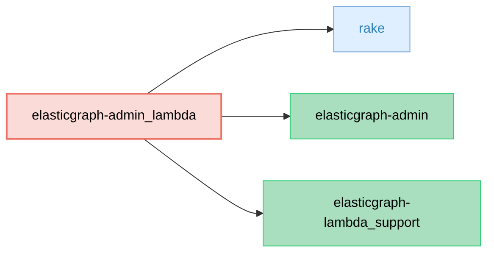

# ElasticGraph::AdminLambda

Adapts `elasticgraph-admin` to run as an AWS Lambda.

## Dependency Diagram

```mermaid
graph LR;
    classDef targetGemStyle fill:#FADBD8,stroke:#EC7063,color:#000,stroke-width:2px;
    classDef otherEgGemStyle fill:#A9DFBF,stroke:#2ECC71,color:#000;
    classDef externalGemStyle fill:#E0EFFF,stroke:#70A1D7,color:#2980B9;
    elasticgraph-admin_lambda["elasticgraph-admin_lambda"];
    class elasticgraph-admin_lambda targetGemStyle;
    rake["rake"];
    elasticgraph-admin_lambda --> rake;
    class rake externalGemStyle;
    elasticgraph-admin["elasticgraph-admin"];
    elasticgraph-admin_lambda --> elasticgraph-admin;
    class elasticgraph-admin otherEgGemStyle;
    elasticgraph-lambda_support["elasticgraph-lambda_support"];
    elasticgraph-admin_lambda --> elasticgraph-lambda_support;
    class elasticgraph-lambda_support otherEgGemStyle;
    click rake href "https://rubygems.org/gems/rake" "Open on RubyGems.org" _blank;
```
