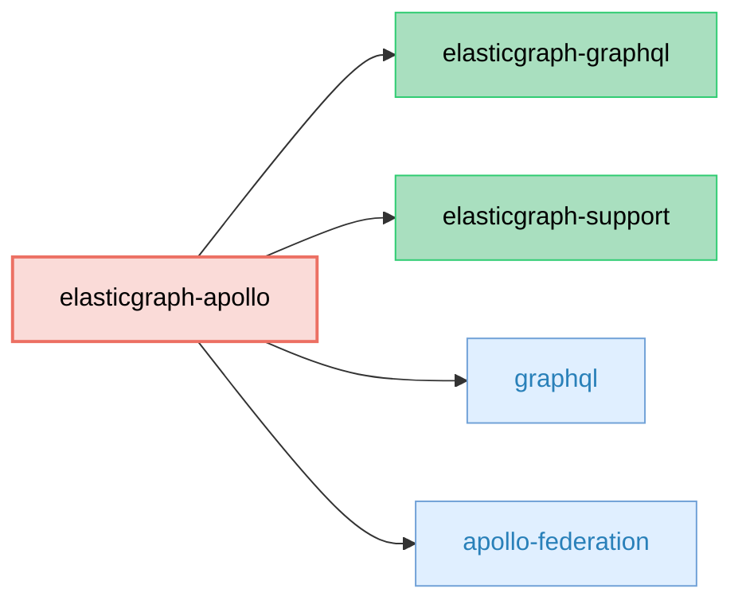

# ElasticGraph::Apollo

Implements the [Apollo Federation Subgraph Spec](https://www.apollographql.com/docs/federation/subgraph-spec/),
allowing an ElasticGraph application to be plugged into an Apollo-powered GraphQL server as a subgraph.

Note: this library only supports the v2 Federation specification.

## Dependency Diagram



## Usage

First, add `elasticgraph-apollo` to your `Gemfile`, alongside the other ElasticGraph gems:

```diff
diff --git a/Gemfile b/Gemfile
index 4a5ef1e..5c16c2b 100644
--- a/Gemfile
+++ b/Gemfile
@@ -8,6 +8,7 @@ gem "elasticgraph-query_registry", *elasticgraph_details

 # Can be elasticgraph-elasticsearch or elasticgraph-opensearch based on the datastore you want to use.
 gem "elasticgraph-opensearch", *elasticgraph_details
+gem "elasticgraph-apollo", *elasticgraph_details

 gem "httpx", "~> 1.3"

```

Finally, update `Rakefile` so that `ElasticGraph::GraphQL::Apollo::SchemaDefinition::APIExtension` is
used as one of the `extension_modules`:

```diff
diff --git a/Rakefile b/Rakefile
index 2943335..26633c3 100644
--- a/Rakefile
+++ b/Rakefile
@@ -1,5 +1,6 @@
 project_root = File.expand_path(__dir__)

+require "elastic_graph/apollo/schema_definition/api_extension"
 require "elastic_graph/local/rake_tasks"
 require "elastic_graph/query_registry/rake_tasks"
 require "rspec/core/rake_task"
@@ -12,6 +13,8 @@ ElasticGraph::Local::RakeTasks.new(
   local_config_yaml: settings_file,
   path_to_schema: "#{project_root}/config/schema.rb"
 ) do |tasks|
+  tasks.schema_definition_extension_modules = [ElasticGraph::Apollo::SchemaDefinition::APIExtension]
+
   # Set this to true once you're beyond the prototyping stage.
   tasks.enforce_json_schema_version = false

```

That's it!

## Federation Version Support

This library supports multiple versions of Apollo federation. The latest release supports:

* v2.0
* v2.3
* v2.5
* v2.6

By default, the newest version is targeted. If you need an older version (e.g. because your organization is running
an older Apollo version), you can configure it in your schema definition with `schema.target_apollo_federation_version`:

```diff
diff --git a/config/schema.rb b/config/schema.rb
index 015c5fa..362cdcb 100644
--- a/config/schema.rb
+++ b/config/schema.rb
@@ -4,6 +4,8 @@ ElasticGraph.define_schema do |schema|
   # ElasticGraph will tell you when you need to bump this.
   schema.json_schema_version 1

+  schema.target_apollo_federation_version "2.3"
+
   # This registers the elasticgraph-query_registry extension, which can be used to reject queries that
   # clients have not registered (and to reject queries that differ from what a client has registered).
   # In addition, every registered query is validated against the schema in the CI build, giving you
```
