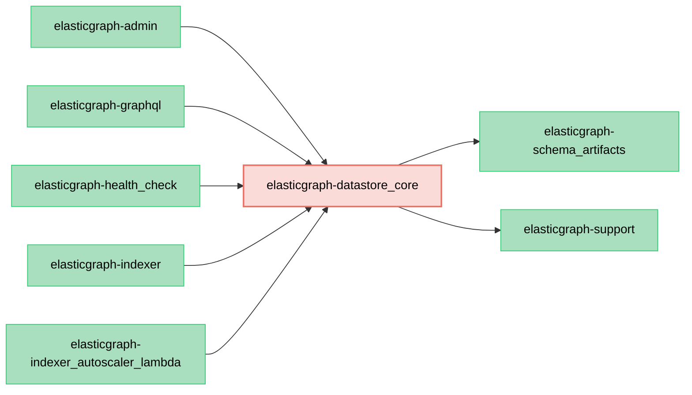

# ElasticGraph::DatastoreCore

Contains the core datastore logic used by the rest of ElasticGraph.

## Dependency Diagram

```mermaid
graph LR;
    classDef targetGemStyle fill:#FADBD8,stroke:#EC7063,color:#000,stroke-width:2px;
    classDef otherEgGemStyle fill:#A9DFBF,stroke:#2ECC71,color:#000;
    classDef externalGemStyle fill:#E0EFFF,stroke:#70A1D7,color:#2980B9;
    elasticgraph-datastore_core["elasticgraph-datastore_core"];
    class elasticgraph-datastore_core targetGemStyle;
    elasticgraph-schema_artifacts["elasticgraph-schema_artifacts"];
    elasticgraph-datastore_core --> elasticgraph-schema_artifacts;
    class elasticgraph-schema_artifacts otherEgGemStyle;
    elasticgraph-support["elasticgraph-support"];
    elasticgraph-datastore_core --> elasticgraph-support;
    class elasticgraph-support otherEgGemStyle;
    elasticgraph-admin["elasticgraph-admin"];
    elasticgraph-admin --> elasticgraph-datastore_core;
    class elasticgraph-admin otherEgGemStyle;
    elasticgraph-graphql["elasticgraph-graphql"];
    elasticgraph-graphql --> elasticgraph-datastore_core;
    class elasticgraph-graphql otherEgGemStyle;
    elasticgraph-health_check["elasticgraph-health_check"];
    elasticgraph-health_check --> elasticgraph-datastore_core;
    class elasticgraph-health_check otherEgGemStyle;
    elasticgraph-indexer["elasticgraph-indexer"];
    elasticgraph-indexer --> elasticgraph-datastore_core;
    class elasticgraph-indexer otherEgGemStyle;
    elasticgraph-indexer_autoscaler_lambda["elasticgraph-indexer_autoscaler_lambda"];
    elasticgraph-indexer_autoscaler_lambda --> elasticgraph-datastore_core;
    class elasticgraph-indexer_autoscaler_lambda otherEgGemStyle;
```
