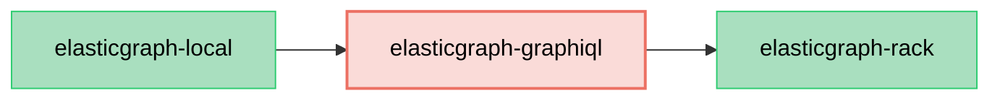

# ElasticGraph::GraphiQL

Provides a GraphiQL IDE for ElasticGraph projects.

## Dependency Diagram



## Usage

Use this gem with any rack-compatible server. Here's an example `config.ru`:

```ruby
require 'elastic_graph/graphql'
require 'elastic_graph/graphiql'

graphql = ElasticGraph::GraphQL.from_yaml_file("config/settings/local.yaml")
run ElasticGraph::GraphiQL.new(graphql)
```

Run this with `rackup` (after installing the `rackup` gem) or any other rack-compatible server.

## License

elasticgraph-graphiql is released under the [MIT License](https://opensource.org/licenses/MIT).

Part of the distributed code comes from the [GraphiQL project](https://github.com/graphql/graphiql),
also licensed under the MIT License, Copyright (c) GraphQL Contributors.
