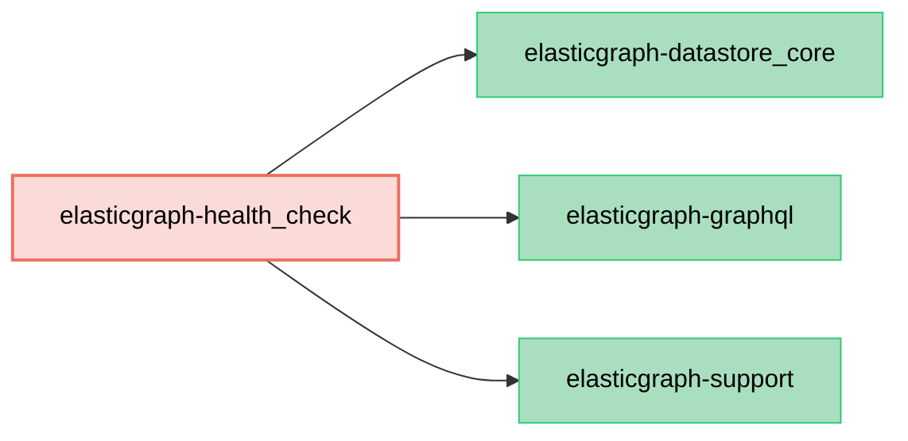

# ElasticGraph::HealthCheck

Provides a component that can act as a health check for high availability deployments. The HealthCheck component
returns a summary status of either `healthy`, `degraded`, or `unhealthy` for the endpoint.

The intended semantics of these statuses
map to the corresponding Envoy statuses, see
[the Envoy documentation for more details](https://www.envoyproxy.io/docs/envoy/latest/intro/arch_overview/upstream/health_checking),
but in short `degraded` maps to "endpoint is impaired, do not use unless you have no other choice" and `unhealthy` maps to "endpoint is hard
down/should not be used under any circumstances".

The returned status is the worst of the status values from the individual sub-checks:
1. The datastore clusters' own health statuses. The datastore clusters reflect their status as green/yellow/red. See
   [the Elasticsearch documentation](https://www.elastic.co/guide/en/elasticsearch/reference/current/cluster-health.html)
   for details on the meaning of these statuses.
   - `green` maps to `healthy`, `yellow` to `degraded`, and `red` to `unhealthy`.

2. The recency of data present in ElasticGraph indices. The HealthCheck configuration specifies the expected "max recency" for items within an
   index.
   - If no records have been indexed within the specified period, the HealthCheck component will consider the index to be in a `degraded` status.

As mentioned above, the returned status is the worst status of these two checks. E.g. if the datastore cluster(s) are all `green`, but a recency check fails, the
overall status will be `degraded`. If the recency checks pass, but at least one datastore cluster is `red`, an `unhealthy` status will be returned.

## Dependency Diagram



## Integration

To use, add the gem to your bundle:

```diff
diff --git a/Gemfile b/Gemfile
index 4a5ef1e..5e9251d 100644
--- a/Gemfile
+++ b/Gemfile
@@ -8,6 +8,7 @@ gem "elasticgraph-query_registry", *elasticgraph_details

 # Can be elasticgraph-elasticsearch or elasticgraph-opensearch based on the datastore you want to use.
 gem "elasticgraph-opensearch", *elasticgraph_details
+gem "elasticgraph-health_check", *elasticgraph_details

 gem "httpx", "~> 1.3"

```

Then register the `EnvoyExtension` when defining your schema:

```diff
diff --git a/config/schema.rb b/config/schema.rb
index 015c5fa..e3e60c6 100644
--- a/config/schema.rb
+++ b/config/schema.rb
@@ -12,6 +12,11 @@ ElasticGraph.define_schema do |schema|
   # If you don't want to use this extension, you can remove these lines.
   require(query_registry_path = "elastic_graph/query_registry/graphql_extension")
   schema.register_graphql_extension ElasticGraph::QueryRegistry::GraphQLExtension, defined_at: query_registry_path
+
+  require(envoy_extension_path = "elastic_graph/health_check/envoy_extension")
+  schema.register_graphql_extension ElasticGraph::HealthCheck::EnvoyExtension,
+    defined_at: envoy_extension_path,
+    http_path_segment: "/_status"
 end

 # Load the rest of the schema from files at config/schema/**/*.rb.
```

Finally, configure it:

```yaml
health_check:
  clusters_to_consider: ["main"]
  data_recency_checks:
    Widget:
      timestamp_field: createdAt
      expected_max_recency_seconds: 30
```

- `clusters_to_consider` configures the first check (datastore cluster health), and specifies which clusters' health status is monitored.
- `data_recency_checks` configures the second check (data recency), and configures the recency check described above. In this example, if no new "Widgets"
  are indexed for thirty seconds (perhaps because of an infrastructure issue), a `degraded` status will be returned.
  - Note that this setting is most appropriate for types where you expect a steady stream of indexing (and where the absence of new records is indicative
    of some kind of failure).

## Behavior when datastore clusters are inaccessible

A given ElasticGraph GraphQL endpoint does not necessarily have access to all datastore clusters - more specifically, the endpoint will only have access
to clusters present in the `datastore.clusters` configuration map.

If a health check is configured for either a cluster or type that the GraphQL endpoint does not have access to, the respective check will be skipped. This is appropriate,
as since the GraphQL endpoint does not have access to the cluster/type, the cluster's/type's health is immaterial.

For example, with the following configuration:

```
datastore:
  clusters:
    widgets-cluster: { ... }
    # components-cluster: { ... } ### Not available, commented out.
health_check:
  clusters_to_consider: ["widgets-cluster", "components-cluster"]
  data_recency_checks:
    Component:
      timestamp_field: createdAt
      expected_max_recency_seconds: 10
    Widget:
      timestamp_field: createdAt
      expected_max_recency_seconds: 30
```

... the `components-cluster` datastore status health check will be skipped, as will the Component recency check. However the `widgets-cluster`/`Widget` health
checks will proceed as normal.
