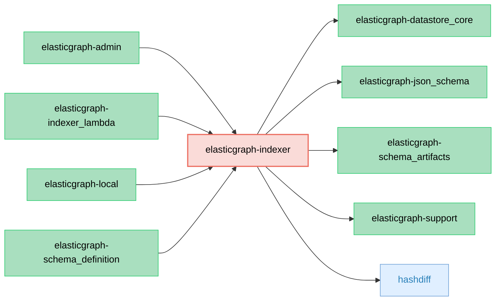

# ElasticGraph::Indexer

ElasticGraph gem that provides APIs to robustly index data into a datastore.

## Dependency Diagram



## Usage

```ruby
require "elastic_graph/indexer"

indexer = ElasticGraph::Indexer.from_yaml_file("config/settings/local.yaml")

events = [] # JSON events read from an async datastream
indexer.processor.process(events)
```
