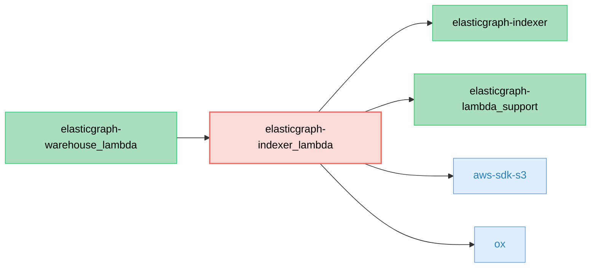

# ElasticGraph::IndexerLambda

Adapts elasticgraph-indexer to run in an AWS Lambda.

## Dependency Diagram



## SQS Message Payload Format

This gem is designed to run in an AWS lambda that consumes from an SQS queue. Messages in the SQS queue should use
[JSON Lines](https://jsonlines.org/) format to encode indexing events.

JSON lines format contains individual JSON objects
delimited by a newline control character(not the `\n` string sequence), such as:

```
{"op": "upsert", "__typename": "Widget", "id": "123", "version": 1, "record": {...} }
{"op": "upsert", "__typename": "Widget", "id": "123", "version": 2, record: {...} }
```

When publishing into SQS, be sure to keep messages under the [256 KiB SQS message limit](https://docs.aws.amazon.com/AWSSimpleQueueService/latest/SQSDeveloperGuide/quotas-messages.html).
