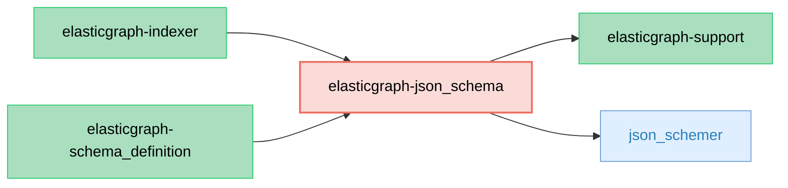

# ElasticGraph::JSONSchema

Provides JSON Schema validation for ElasticGraph.

## Dependency Diagram

```mermaid
graph LR;
    classDef targetGemStyle fill:#FADBD8,stroke:#EC7063,color:#000,stroke-width:2px;
    classDef otherEgGemStyle fill:#A9DFBF,stroke:#2ECC71,color:#000;
    classDef externalGemStyle fill:#E0EFFF,stroke:#70A1D7,color:#2980B9;
    elasticgraph-json_schema["elasticgraph-json_schema"];
    class elasticgraph-json_schema targetGemStyle;
    elasticgraph-support["elasticgraph-support"];
    elasticgraph-json_schema --> elasticgraph-support;
    class elasticgraph-support otherEgGemStyle;
    json_schemer["json_schemer"];
    elasticgraph-json_schema --> json_schemer;
    class json_schemer externalGemStyle;
    elasticgraph-indexer["elasticgraph-indexer"];
    elasticgraph-indexer --> elasticgraph-json_schema;
    class elasticgraph-indexer otherEgGemStyle;
    elasticgraph-schema_definition["elasticgraph-schema_definition"];
    elasticgraph-schema_definition --> elasticgraph-json_schema;
    class elasticgraph-schema_definition otherEgGemStyle;
    click json_schemer href "https://rubygems.org/gems/json_schemer" "Open on RubyGems.org" _blank;
```
