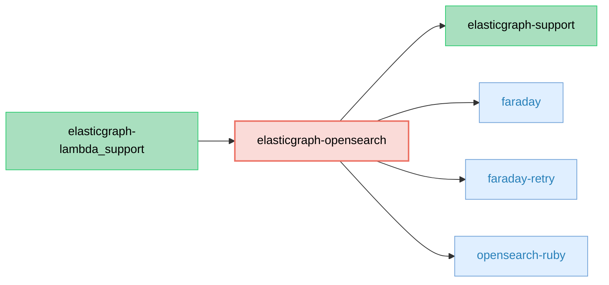

# ElasticGraph::OpenSearch

Wraps the official [OpenSearch client](https://github.com/opensearch-project/opensearch-ruby/) for use by ElasticGraph.

## Dependency Diagram



## Usage

ElasticGraph projects are configured to use this gem or `elasticgraph-elasticsearch`, based on which datastore is being used.

To use an ElasticGraph project with OpenSearch, bootstrap an ElasticGraph project with `--datastore opensearch`:

```bash
gem exec elasticgraph new path/to/project --datastore opensearch
```

### Migrate from Elasticsearch to OpenSearch

If you need to convert an existing project to use OpenSearch instead of Elasticsearch, here's how to do that.

First, replace `elasticgraph-elasticsearch` with `elasticgraph-opensearch` in the `Gemfile`:

```diff
diff --git a/Gemfile b/Gemfile
index 4a5ef1e..cc0e1fb 100644
--- a/Gemfile
+++ b/Gemfile
@@ -7,7 +7,7 @@ gem "elasticgraph-local", *elasticgraph_details
 gem "elasticgraph-query_registry", *elasticgraph_details

 # Can be elasticgraph-elasticsearch or elasticgraph-opensearch based on the datastore you want to use.
-gem "elasticgraph-elasticsearch", *elasticgraph_details
+gem "elasticgraph-opensearch", *elasticgraph_details

 gem "httpx", "~> 1.3"

```

Then, update the settings YAML file to configure `opensearch` as the cluster backend:

```diff
diff --git a/config/settings/local.yaml b/config/settings/local.yaml
index 963f4f9..16eb063 100644
--- a/config/settings/local.yaml
+++ b/config/settings/local.yaml
@@ -4,7 +4,7 @@ datastore:
     require: httpx/adapters/faraday
   clusters:
     main:
-      backend: elasticsearch
+      backend: opensearch
       url: http://localhost:9200
       settings: {}
   index_definitions:
```
