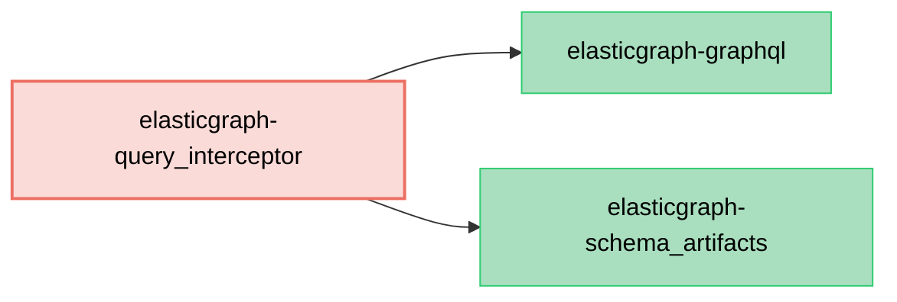

# ElasticGraph::QueryInterceptor

An ElasticGraph extension for intercepting datastore queries.

Interceptors can customize/modify datastore queries before they are submitted to Elasticsearch or OpenSearch.
Some of the use cases for query interceptors include:

* **Automatic filtering**: A query interceptor can apply default filtering to a query. For example, this can be used to automatically exclude soft-deleted/tombstoned records.
* **Query optimization**: When querying an index that uses shard routing or rollover, queries that filter on the shard routing or rollover timestamp fields are much more performant. A query interceptor can apply filters on these fields after querying a derived index for the appropriate values.

## Dependency Diagram



## Setup

First, add `elasticgraph-query_interceptor` to your `Gemfile`:

```diff
diff --git a/Gemfile b/Gemfile
index 4a5ef1e..5c16c2b 100644
--- a/Gemfile
+++ b/Gemfile
@@ -8,6 +8,7 @@ gem "elasticgraph-query_registry", *elasticgraph_details

 # Can be elasticgraph-elasticsearch or elasticgraph-opensearch based on the datastore you want to use.
 gem "elasticgraph-opensearch", *elasticgraph_details
+gem "elasticgraph-query_interceptor", *elasticgraph_details

 gem "httpx", "~> 1.3"

```

Next, define the interceptor. Interceptor must implement this interface:

```ruby
# lib/example_interceptor.rb
class ExampleInterceptor
  def initialize(elasticgraph_graphql:, config:)
    # `elasticgraph_graphql` is the `ElasticGraph::GraphQL` instance and has access to things like the
    # datastore client in case you need it in your interceptor. This can be useful if you need to perform
    # lookups on a derived index as part of your interceptor logic.
    #
    # `config` is a hash containing parameterized configuration values specific in the YAML settings
    # (see below for an example).
  end

  def intercept(query, field:, args:, http_request:, context:)
    # `query` is an `ElasticGraph::GraphQL::DatastoreQuery` that will be submitted to the datastore
    # as part of satisfying a GraphQL query.
    #
    # `field`, `args`, and `context` provide access to GraphQL query information which can be used
    # in your interceptor logic to influence how you modify the datastore query.
    #
    # `http_request` provides access to the original HTTP request and can likewise be used in your logic.
    #
    # Use `query.merge_with(...)` as desired to merge in query overrides like filters, or just return `query`.
    # (This method must return a query.)
  end
end
```

Finally, update your project's YAML config to enable this extension and configure it to use the interceptor:

```diff
diff --git a/config/settings/local.yaml b/config/settings/local.yaml
index 963f4f9..93df6f3 100644
--- a/config/settings/local.yaml
+++ b/config/settings/local.yaml
@@ -23,6 +23,15 @@ datastore:
 graphql:
   default_page_size: 50
   max_page_size: 500
+  extension_modules:
+  - require_path: elastic_graph/query_interceptor/graphql_extension
+    name: ElasticGraph::QueryInterceptor::GraphQLExtension
+query_interceptor:
+  interceptors:
+  - require_path: ./lib/example_interceptor
+    name: ExampleInterceptor
+    config: # Optional
+      foo: bar
 logger:
   device: stderr
 indexer:
```

As shown above, an optional "config" dictionary can be provided to pass in values to
your interceptor when it is initialized.
