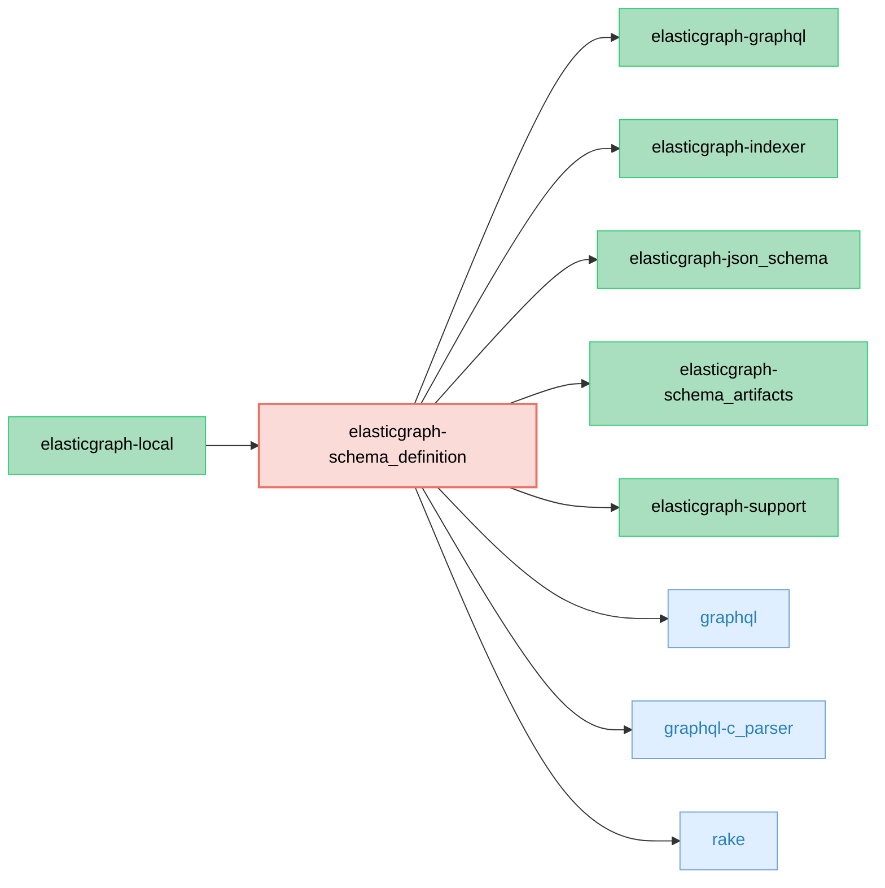

# ElasticGraph::SchemaDefinition

Provides the ElasticGraph schema definition API, which is used to
generate ElasticGraph's schema artifacts.

This gem is not intended to be used in production--production should
just use the schema artifacts instead.

## Dependency Diagram



## Usage

Define the shape of your data using the schema definition API:

```ruby
# in config/schema/team.rb

ElasticGraph.define_schema do |schema|
  schema.enum_type "SportsLeague" do |t|
    t.value "MLB"
    t.value "NBA"
    t.value "NFL"
    t.value "NHL"
  end

  schema.object_type "Team" do |t|
    t.field "id", "ID!"
    t.field "league", "SportsLeague"
    t.field "formedOn", "Date"
    t.field "currentName", "String"
    t.field "pastNames", "[String!]!"
    t.field "stadiumLocation", "GeoLocation"

    t.index "teams"
  end
end
```

The default rake task (`bundle exec rake`) performs a full build, including generating schema artifacts.
You can directly generate schema artifacts with:

```bash
bundle exec rake schema_artifacts:dump
```

To see if the artifacts are up-to-date, run:

```bash
bundle exec rake schema_artifacts:check
```
