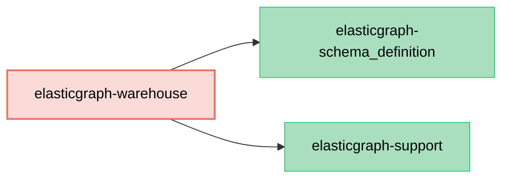

# ElasticGraph::Warehouse

Generates Data Warehouse table configurations from ElasticGraph schemas, enabling seamless integration
with data warehouse systems like Apache Hive, AWS Athena, and similar SQL-based analytical platforms.

This extension allows you to define warehouse table mappings directly in your ElasticGraph schema,
automatically generating the necessary DDL and configuration files for your data warehouse.

## Dependency Diagram



## Usage

First, add `elasticgraph-warehouse` to your `Gemfile`, alongside the other ElasticGraph gems:

```diff
diff --git a/Gemfile b/Gemfile
index 4a5ef1e..5c16c2b 100644
--- a/Gemfile
+++ b/Gemfile
@@ -8,6 +8,7 @@ gem "elasticgraph-query_registry", *elasticgraph_details

 # Can be elasticgraph-elasticsearch or elasticgraph-opensearch based on the datastore you want to use.
 gem "elasticgraph-opensearch", *elasticgraph_details
+gem "elasticgraph-warehouse", *elasticgraph_details

 gem "httpx", "~> 1.3"

```

Next, update your `Rakefile` so that `ElasticGraph::Warehouse::SchemaDefinition::APIExtension` is
used as one of the `extension_modules`:

```diff
diff --git a/Rakefile b/Rakefile
index 2943335..26633c3 100644
--- a/Rakefile
+++ b/Rakefile
@@ -1,5 +1,6 @@
 project_root = File.expand_path(__dir__)

+require "elastic_graph/warehouse/schema_definition/api_extension"
 require "elastic_graph/local/rake_tasks"
 require "elastic_graph/query_registry/rake_tasks"
 require "rspec/core/rake_task"
@@ -12,6 +13,8 @@ ElasticGraph::Local::RakeTasks.new(
   local_config_yaml: settings_file,
   path_to_schema: "#{project_root}/config/schema.rb"
 ) do |tasks|
+  tasks.schema_definition_extension_modules = [ElasticGraph::Warehouse::SchemaDefinition::APIExtension]
+
   # Set this to true once you're beyond the prototyping stage.
   tasks.enforce_json_schema_version = false

```

Finally, define warehouse tables in your schema:

```ruby
# in config/schema/order.rb

ElasticGraph.define_schema do |schema|
  schema.object_type "Order" do |t|
    t.field "id", "ID"
    t.field "totalAmount", "Float"
    t.field "createdAt", "DateTime"
    
    # Define a warehouse table for this type
    t.warehouse_table "orders"
    
    t.index "orders"
  end
end
```

That's it! When you run `rake schema_artifacts:dump`, a `data_warehouse.yaml` file will be generated
alongside your other schema artifacts.

## Schema Definition DSL

### Defining Warehouse Tables

The warehouse extension adds a `warehouse_table` method to object and interface types:

```ruby
# in config/schema/person.rb

ElasticGraph.define_schema do |schema|
  schema.object_type "Person" do |t|
    t.field "id", "ID"
    t.field "name", "String"
    t.field "age", "Int"

    # Define a warehouse table for this type
    t.warehouse_table "person", retention_days: 90 do |wt|
      # block is optional; reserved for future table-level customizations
    end
  end
end
```

### Configuring Scalar Types

You can also configure warehouse table types for scalar types:

```ruby
# in config/schema/scalars.rb

ElasticGraph.define_schema do |schema|
  schema.scalar_type "MyDateTime" do |t|
    # existing mapping/json_schema still required
    t.mapping type: "date", format: ElasticGraph::DATASTORE_DATE_TIME_FORMAT
    t.json_schema type: "string", format: "date-time"

    # New: warehouse table type
    t.warehouse_table table_type: "TIMESTAMP"
  end
end
```

## Generated Artifacts

When you run `rake schema_artifacts:dump`, the extension generates a `data_warehouse.yaml` file
in your artifacts directory (typically `config/schema/artifacts/`).

The file contains warehouse table configurations keyed by table name:

```yaml
orders:
  settings:
    retention_days: 90
  table_schema: |
    CREATE TABLE IF NOT EXISTS orders (
      id STRING,
      totalAmount DOUBLE,
      createdAt TIMESTAMP,
      customer STRUCT<id STRING, name STRING>,
      items ARRAY<STRUCT<sku STRING, quantity INT>>
    )
```

### Table Schema Format

The generated configuration includes:

- **`table_schema`**: A complete `CREATE TABLE` SQL DDL statement that can be executed directly in SQL-based warehouse systems like Hive, Athena, or Presto. The statement includes all field definitions with proper formatting and indentation.
- **`settings`**: Custom settings passed through from the schema definition (e.g., `retention_days`, or any other warehouse-specific configuration)

The table schema is automatically derived from your ElasticGraph type definitions, including:
- Nested objects as `STRUCT` types
- Arrays as `ARRAY` types  
- Proper nullability handling
- Type mappings from GraphQL scalars to warehouse types

## How It Works

The warehouse extension integrates with ElasticGraph's schema definition system through:

1. **Factory Extensions**: Extends the schema factory to add `warehouse_table` methods to types
2. **Type Extensions**: Adds warehouse field type conversion capabilities to all schema types
3. **Results Extension**: Adds `warehouse_config` to schema definition results
4. **Artifact Manager Extension**: Hooks into the artifact dumping process to generate `data_warehouse.yaml`

The extension follows ElasticGraph's modular design principles, only activating when explicitly included
as an extension module.

## Troubleshooting

### Warehouse artifact not being generated

If the `data_warehouse.yaml` file is not being generated, ensure that:

1. The warehouse gem is properly required before defining rake tasks
2. The extension module is added to `schema_definition_extension_modules`
3. At least one type has a `warehouse_table` definition in your schema

### Type resolution errors

If you encounter errors about unresolved types, this typically means:

1. A field references a type that doesn't have warehouse field type support
2. The type needs to have the warehouse extension applied to it

The extension automatically handles all built-in ElasticGraph types and any custom types
defined in your schema.

## License

MIT
