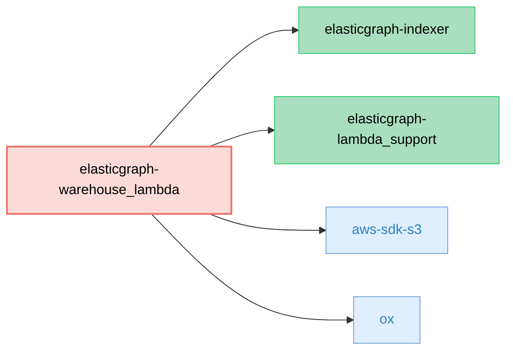

# ElasticGraph::WarehouseLambda
<!-- Mermaid dependency diagram -->


Write ElasticGraph-shaped JSONL files to S3, packaged for AWS Lambda.

This gem adapts ElasticGraph’s indexing pipeline so that, instead of writing to the datastore,
it writes batched, gzipped JSON Lines (JSONL) files to Amazon S3. Each line in the file
conforms to your ElasticGraph schema’s latest JSON Schema for the corresponding object type.

## What it does

- Consumes ElasticGraph indexing operations and groups them by GraphQL type
- Transforms each operation into a flattened JSON document that matches your ElasticGraph schema
- Writes one gzipped JSONL file per type per batch to S3 with deterministic keys:
  - s3://<bucket>/dumped-data/<s3_path_prefix>/<TypeName>/v<json_schema_version>/<YYYY-MM-DD>/<uuid>.jsonl.gz
- Emits structured logs for observability (counts, sizes, S3 key, etc.)

## When to use it

Use this when you need a durable, append-only export of ElasticGraph data suitable for ingestion
by downstream systems (e.g., data warehouses, lakehouses, or offline analytics pipelines). It’s a
drop-in replacement for the Indexer’s datastore router: instead of indexing into the datastore,
you persist JSONL to S3.

## Configuration

Configuration is sourced from your normal ElasticGraph YAML settings and environment variables used in Lambda.

- YAML (ELASTICGRAPH_YAML_CONFIG):
  - warehouse:
    - s3_path_prefix: Prefix for S3 keys under dumped-data/ (e.g., "Data001")
- Environment Variables:
  - DATAWAREHOUSE_S3_BUCKET_NAME: The S3 bucket name to write JSONL files into (required)
  - REPORT_BATCH_ITEM_FAILURES: "true" to enable SQS partial batch failure responses (optional)

Example YAML override snippet:

```yaml
warehouse:
  s3_path_prefix: Data001
```

## Key format

Files are written with the following S3 key format:

```
dumped-data/<s3_path_prefix>/<TypeName>/v<json_schema_version>/<YYYY-MM-DD>/<uuid>.jsonl.gz
```

- s3_path_prefix: Configurable in YAML (warehouse.s3_path_prefix)
- TypeName: GraphQL type from the ElasticGraph event
- json_schema_version: The latest JSON Schema version available to the Indexer
- YYYY-MM-DD: UTC date when the batch was processed
- uuid: A random UUID for uniqueness

## Runtime and deps

- Runs in AWS Lambda via elasticgraph-lambda_support
- Depends on elasticgraph-indexer for event preparation and schema artifacts
- Uses aws-sdk-s3 to write to S3

## Example: Lambda handler

This gem exposes a handler constant for AWS Lambda:

```ruby
# elastic_graph/warehouse_lambda/lambda_function.rb
ElasticGraphWarehouse = ElasticGraph::WarehouseLambda::LambdaFunction.new
```

Deploy your Lambda with that handler entry. The function consumes SQS events in the
same format as `elasticgraph-indexer_lambda` and writes JSONL to S3.

## Observability

The Lambda logs structured events:
- WarehouseLambdaReceivedBatch: counts per type for incoming batch
- DumpedToWarehouseFile: S3 key, type, record_count, json_size, gzip_size

## Local development

- Ensure all ElasticGraph gems are vendored/linked via the repo Gemfile
- Run the gem’s unit tests:

```
bundle exec rspec elasticgraph-warehouse_lambda/spec/unit
```

## License

MIT © Block, Inc.
