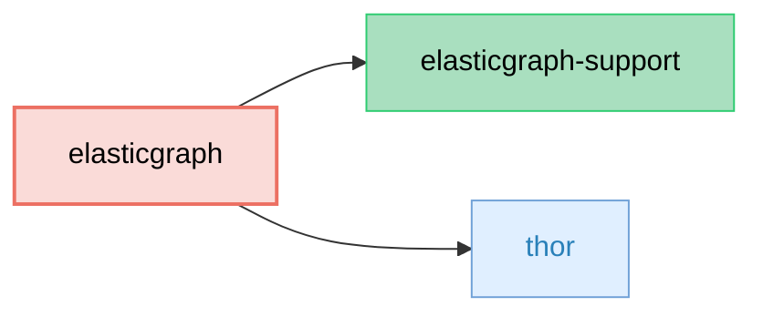

# ElasticGraph

Bootstraps ElasticGraph projects.

## Dependency Diagram



## Usage

Run one of these commands to bootstrap a new ElasticGraph project:

```bash
gem exec elasticgraph new path/to/project --datastore elasticsearch
# or
gem exec elasticgraph new path/to/project --datastore opensearch
```

See our [getting started guide](https://block.github.io/elasticgraph/getting-started/) for a full tutorial.
